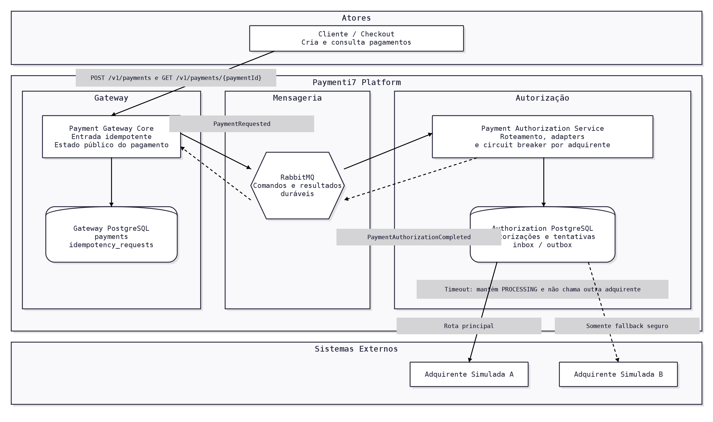

# Paymenti7 Platform

Plataforma de pagamentos assíncrona construída com Spring Boot. O fluxo atual recebe uma intenção idempotente no gateway, valida o merchant, publica o comando pelo padrão Outbox, autoriza o pagamento em um serviço separado e devolve o resultado ao gateway por eventos.

## Arquitetura



### Módulos

| Módulo | Responsabilidade |
| --- | --- |
| `apps/merchant-service` | Consulta e atualiza merchants e publica `MerchantUpdated` por transactional outbox. |
| `apps/payment-gateway-core` | Expõe a API de pagamentos, garante idempotência, mantém o estado público e publica `PaymentRequested`. |
| `apps/payment-authorization-service` | Consome pagamentos, persiste autorizações e tentativas, roteia adquirentes, aplica timeout, circuit breaker e fallback seguro e publica o resultado terminal. |
| `libs/resilience` | Implementa o circuit breaker técnico utilizado separadamente por adquirente. |

### Fluxo de pagamento

1. O cliente envia `POST /v1/payments` com uma `Idempotency-Key` criada por ele.
2. O gateway valida o merchant usando cache-aside com Redis e `merchant-service`.
3. Pagamento, registro idempotente e evento de outbox são gravados na mesma transação no PostgreSQL do gateway.
4. O evento `PaymentRequested` é publicado no RabbitMQ e consumido de forma idempotente pelo authorization service.
5. O authorization service registra a tentativa antes da chamada externa e tenta o `SIMULATOR_A` como rota principal.
6. Somente um resultado `SAFE_TO_FALLBACK` ou um circuito aberto permite seguir para o `SIMULATOR_B`.
7. Um resultado terminal gera `PaymentAuthorizationCompleted` pela outbox do authorization service.
8. O gateway consome o resultado, atualiza o pagamento e armazena a resposta terminal para replay idempotente.

Timeout e outros resultados ambíguos não acionam outra adquirente. A autorização fica em `PENDING_RECONCILIATION` e o pagamento permanece publicamente em `PROCESSING` até existir um processo de reconciliação.

## Decisões importantes

### Idempotência

- `Idempotency-Key` é um UUID obrigatório e deve ser criado por quem chama o gateway.
- Uma chave nova representa uma nova intenção de pagamento.
- A mesma chave com o mesmo payload retorna o pagamento já criado e não inicia outro processamento.
- A mesma chave com um payload diferente retorna `409 Conflict`.
- O `paymentMethodToken` participa do hash do payload.
- Respostas terminais ficam disponíveis para replay por 24 horas; registros ainda em `PROCESSING` não são removidos pela limpeza automática.
- O PostgreSQL do gateway é a fonte de verdade da idempotência. Redis não é usado para garantir idempotência de pagamentos.

### Resultados da adquirente

| Resultado | Comportamento |
| --- | --- |
| `APPROVED` | Conclui o pagamento como aprovado. |
| `DECLINED` | Conclui como recusado, sem tentar outra adquirente. |
| `SAFE_TO_FALLBACK` | Tenta a próxima adquirente; se não houver outra rota, conclui como `FAILED`. |
| `UNKNOWN` | Mantém o pagamento em `PROCESSING`, marca a autorização para reconciliação e não executa fallback. |

`SAFE_TO_FALLBACK` é um resultado da tentativa, não um status público do pagamento. Ele somente deve ser produzido quando há certeza de que a adquirente não processou a autorização.

### Circuit breaker

Existe um circuit breaker em memória por adquirente e por instância do authorization service.

| Estado | Regra padrão |
| --- | --- |
| `CLOSED` | Janela de 30 segundos; após pelo menos 100 chamadas, abre com 50% ou mais de falhas técnicas. |
| `OPEN` | Permanece aberto por 60 segundos; nenhuma chamada chega à adquirente e pagamentos novos seguem por fallback seguro. |
| `HALF_OPEN` | Seleciona deterministicamente 10% dos pagamentos como probes, com no máximo 20 probes concorrentes. |

No `HALF_OPEN`, a avaliação exige 100 probes concluídas e pelo menos 10 segundos de observação. Uma taxa de sucesso técnico de 95% ou mais fecha o circuito; abaixo disso ele volta para `OPEN`. Se a amostra não for concluída em 2 minutos, o circuito também reabre.

Para o breaker, `APPROVED` e `DECLINED` são sucessos técnicos. Timeout, resposta ambígua e falhas técnicas contam como erro.

## Tecnologias

- Java 25 e Spring Boot 4.1
- Maven Wrapper
- PostgreSQL 17, Flyway e JPA/Hibernate
- RabbitMQ 4.3
- Redis 7.4 para cache de merchants e deduplicação de eventos de merchant
- Resilience4j
- Docker Compose para infraestrutura local
- Testcontainers para testes de integração
- springdoc/OpenAPI para Swagger UI

## Execução local

### Pré-requisitos

- JDK 25 configurado no `JAVA_HOME`;
- Docker Engine ou Docker Desktop com Docker Compose;
- portas locais da próxima seção disponíveis.

### 1. Configurar o ambiente

Na raiz do repositório:

```bash
cp .env.example .env
```

### 2. Subir a infraestrutura

O Compose contém somente a infraestrutura; as aplicações podem ser iniciadas pelo IntelliJ.

```bash
docker compose up -d postgres gateway-postgres authorization-postgres rabbitmq redis
docker compose ps
```

RabbitMQ Management fica disponível em [http://localhost:15672](http://localhost:15672), com usuário e senha `paymenti7` no ambiente local padrão.

### 3. Criar um merchant local

Ainda não existe endpoint de criação de merchant. Para o teste local, insira um merchant ativo diretamente no banco:

```bash
docker compose exec -T postgres psql \
  -U paymenti7 \
  -d paymenti7_merchant \
  -c "INSERT INTO merchants (id, status) VALUES ('11111111-1111-1111-1111-111111111111', 'ACTIVE') ON CONFLICT (id) DO UPDATE SET status = 'ACTIVE', updated_at = CURRENT_TIMESTAMP;"
```

### 4. Iniciar as aplicações

No IntelliJ, execute:

- `MerchantServiceApplication`, porta `8090`;
- `PaymentGatewayCoreApplication`, porta `8080`;
- `PaymentAuthorizationServiceApplication`, porta `8100`.

Configure o **Working directory** das três aplicações com a raiz do repositório. Assim, `spring.config.import=optional:file:.env[.properties]` encontrará o arquivo `.env`.

Também é possível executar em terminais separados:

Em um clone novo, instale primeiro os módulos compartilhados no repositório Maven local:

```bash
./mvnw -DskipTests install
```

```bash
./mvnw -pl apps/merchant-service spring-boot:run
```

```bash
./mvnw -pl apps/payment-gateway-core spring-boot:run
```

```bash
./mvnw -pl apps/payment-authorization-service spring-boot:run
```

## Portas e bancos locais

| Componente | Porta | Banco/URL |
| --- | ---: | --- |
| payment-gateway-core | 8080 | `http://localhost:8080` |
| merchant-service | 8090 | `http://localhost:8090` |
| payment-authorization-service | 8100 | `http://localhost:8100` |
| PostgreSQL do merchant | 5432 | `paymenti7_merchant` |
| PostgreSQL do gateway | 5433 | `paymenti7_gateway` |
| PostgreSQL do authorization | 5434 | `paymenti7_authorization` |
| RabbitMQ AMQP | 5672 | `amqp://localhost:5672` |
| RabbitMQ Management | 15672 | `http://localhost:15672` |
| Redis | 6380 | `localhost:6380` |

Os três bancos usam `paymenti7` como usuário e senha no ambiente local padrão. As portas e credenciais podem ser alteradas no `.env`.

## APIs e Swagger

| Serviço | Swagger UI | OpenAPI JSON |
| --- | --- | --- |
| merchant-service | [http://localhost:8090/swagger-ui.html](http://localhost:8090/swagger-ui.html) | [http://localhost:8090/v3/api-docs](http://localhost:8090/v3/api-docs) |
| payment-gateway-core | [http://localhost:8080/swagger-ui.html](http://localhost:8080/swagger-ui.html) | [http://localhost:8080/v3/api-docs](http://localhost:8080/v3/api-docs) |

| Serviço | Método | Rota | Descrição |
| --- | --- | --- | --- |
| merchant-service | `PUT` | `/v1/admin/merchants/{merchantId}` | Atualiza o status de um merchant existente. |
| payment-gateway-core | `POST` | `/v1/payments` | Aceita uma intenção idempotente e inicia o processamento assíncrono. |
| payment-gateway-core | `GET` | `/v1/payments/{paymentId}` | Consulta o estado atual do pagamento. |

O authorization service não expõe API pública de negócio; ele trabalha por RabbitMQ. `GET /internal/v1/merchants/{merchantId}` é uma rota interna e não aparece no Swagger público.

## Testando um pagamento

Com toda a plataforma em execução:

```bash
curl -i \
  -X POST http://localhost:8080/v1/payments \
  -H 'Content-Type: application/json' \
  -H 'Idempotency-Key: 88888888-8888-4888-8888-888888888888' \
  -d '{
    "merchantId": "11111111-1111-1111-1111-111111111111",
    "amount": 150.90,
    "currency": "BRL",
    "paymentMethodToken": "pmt_local_visa_001"
  }'
```

A primeira resposta deve ser `202 Accepted`:

```json
{
  "paymentId": "uuid-gerado-pelo-gateway",
  "status": "PROCESSING"
}
```

Consulte o resultado com o `paymentId` retornado:

```bash
curl -i http://localhost:8080/v1/payments/COLOQUE-O-PAYMENT-ID
```

Com a configuração padrão, o `SIMULATOR_A` aprova e o estado muda para `APPROVED`. Repetir o `POST` com a mesma chave e exatamente o mesmo JSON retorna o mesmo pagamento. Para criar outro pagamento, use uma nova chave.

No Postman, `{{$guid}}` pode ser usado para gerar uma chave nova em cada envio. Para testar replay ou conflito, use uma chave fixa.

## Testando roteamento e fallback

Os simuladores são configurados por argumentos do `payment-authorization-service`. Reinicie somente essa aplicação entre os cenários.

| Cenário | Program arguments no IntelliJ | Resultado esperado |
| --- | --- | --- |
| Rota principal | `--payment.authorization.simulators.simulator-a.outcome=APPROVED --payment.authorization.simulators.simulator-a.delay=0ms` | Uma tentativa no `SIMULATOR_A`; pagamento `APPROVED`. |
| Fallback seguro | `--payment.authorization.simulators.simulator-a.outcome=SAFE_TO_FALLBACK --payment.authorization.simulators.simulator-b.outcome=APPROVED` | A fica `SAFE_TO_FALLBACK`, B aprova e o pagamento termina `APPROVED`. |
| Timeout incerto | `--payment.authorization.adapter-timeout=2s --payment.authorization.simulators.simulator-a.outcome=APPROVED --payment.authorization.simulators.simulator-a.delay=3s` | A fica `UNKNOWN`, autorização `PENDING_RECONCILIATION`, pagamento `PROCESSING` e B não é chamado. |

Use uma nova `Idempotency-Key` em cada cenário.

Para verificar as tentativas no PostgreSQL do authorization:

```sql
SELECT
    ar.payment_id,
    ar.status AS authorization_status,
    ar.terminal_status,
    ar.next_route_index,
    aa.acquirer,
    aa.status AS attempt_status,
    aa.reason_code
FROM authorization_requests ar
LEFT JOIN authorization_attempts aa ON aa.payment_id = ar.payment_id
WHERE ar.payment_id = 'COLOQUE-O-PAYMENT-ID'
ORDER BY aa.created_at;
```

## Testes automatizados

Execute toda a suíte na raiz:

```bash
./mvnw verify
```

Os testes de integração usam Testcontainers e exigem Docker em execução. A suíte cobre idempotência, outbox, contratos OpenAPI, cache de merchant, roteamento, fallback seguro, timeout e circuit breaker.

## ADRs principais

- [ADR-003 — Cache-aside e reidratação de merchant](apps/payment-gateway-core/docs/adrs/ADR-003-cache-aside-merchant-rehydration.md)
- [ADR-005 — Idempotência de requisições de pagamento](apps/payment-gateway-core/docs/adrs/ADR-005-payment-request-idempotency.md)
- [ADR-006 — Autorização, fallback e circuit breaker](apps/payment-gateway-core/docs/adrs/ADR-006-payment-authorization-routing-and-circuit-breaker.md)

## Parando a infraestrutura

Preservando os volumes:

```bash
docker compose down
```

Removendo também todos os dados locais:

```bash
docker compose down -v
```

O segundo comando remove os volumes de PostgreSQL, RabbitMQ e Redis e não pode ser usado quando os dados locais precisam ser preservados.
