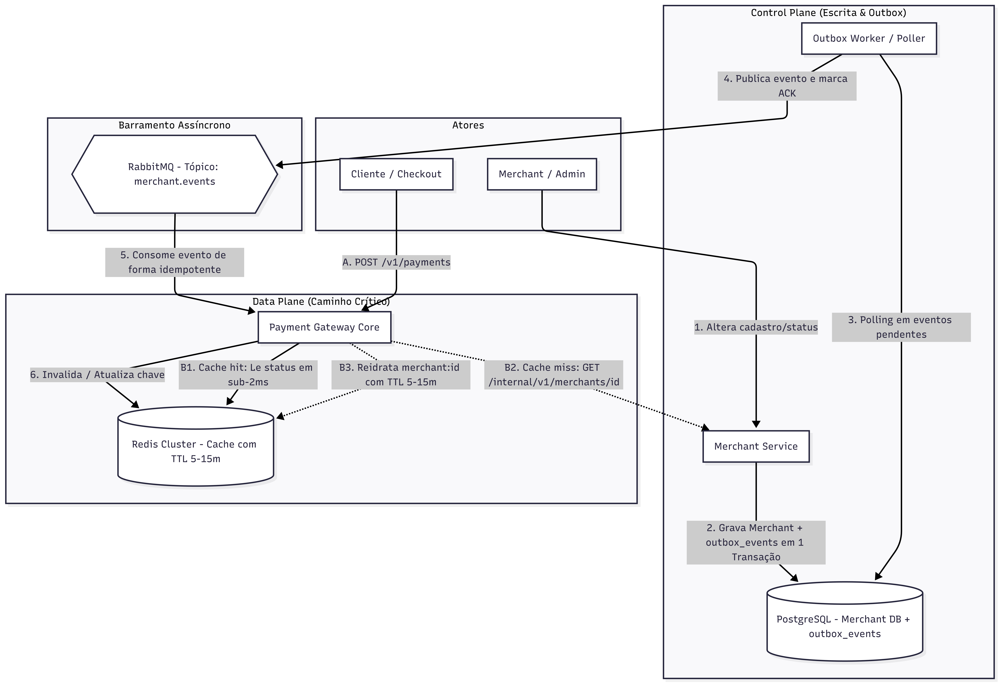

# ADR-003: Reidratação Cache-Aside de Merchant no Data Plane

* **Status:** Aprovado
* **Data:** 2026-08-29
* **Autor:** Edir Lucas da Silva Icety Braga
* **Impacto:** `payment-gateway-core`, `merchant-service`

## 1. Contexto e Problema

As ADRs 001 e 002 do `payment-gateway-core` implementaram o consumo idempotente de `MerchantUpdated`: o evento apaga `merchant:{merchantId}` no Redis e registra o `eventId` processado. A invalidação evita que o Data Plane continue usando a configuração anterior, mas não existia um fluxo para repovoar a chave removida.

O caminho de pagamento precisa validar o status atual do merchant sem acessar o banco de dados do `merchant-service`. Ao mesmo tempo, uma chave de cache não pode permanecer válida indefinidamente: se uma invalidação falhar, sua expiração deve limitar a janela de dados antigos.

## 2. Decisão

O `payment-gateway-core` exporá `POST /v1/payments` como validação inicial de merchant. A requisição recebe `merchantId` e retorna o respectivo status `ACTIVE` ou `INACTIVE`.

O gateway adotará o padrão *cache-aside* para a chave `merchant:{merchantId}`:

1. Consultar o Redis no início da validação.
2. Em *cache hit*, usar `{id, status}` sem chamada remota.
3. Em *cache miss*, chamar `GET /internal/v1/merchants/{merchantId}` no `merchant-service`.
4. Persistir a resposta no Redis com TTL configurável de 10 minutos e retornar o status.

O endpoint interno é a única fonte autoritativa para a reidratação. O gateway nunca acessará o PostgreSQL do `merchant-service` diretamente. A chamada terá timeout de 1 segundo e não terá retry local; merchant inexistente resulta em `404` e indisponibilidade ou timeout do serviço resulta em `503`, permitindo repetição pelo cliente sem transformar a falha técnica em recusa de negócio.

O consumer de `MerchantUpdated` continua apagando a chave e mantendo seu marcador de idempotência por 24 horas. Assim, a próxima validação do merchant reidrata o cache com o estado posterior à alteração.

Não será criado cache em memória por instância. Um L1 exigiria invalidação para todas as instâncias e poderia manter um estado divergente do Redis compartilhado.

## 3. Consequências

### Positivas

* O caminho normal de pagamento consulta somente o Redis.
* Cada cache miss reidrata o estado usando a API do serviço proprietário, sem acoplamento ao seu banco.
* O TTL de 10 minutos limita a duração de um estado antigo caso um evento de invalidação seja perdido.
* A invalidação assíncrona reduz a janela normal de desatualização para o tempo de processamento do evento.

### Riscos assumidos

* Depois de uma expiração ou invalidação, a validação depende temporariamente do `merchant-service`.
* Durante indisponibilidade do `merchant-service`, um cache miss retorna `503`; não há autorização baseada em informação não confiável.
* O endpoint `POST /v1/payments` desta fase valida apenas o merchant; autorização financeira e persistência de pagamentos permanecem fora de escopo.
