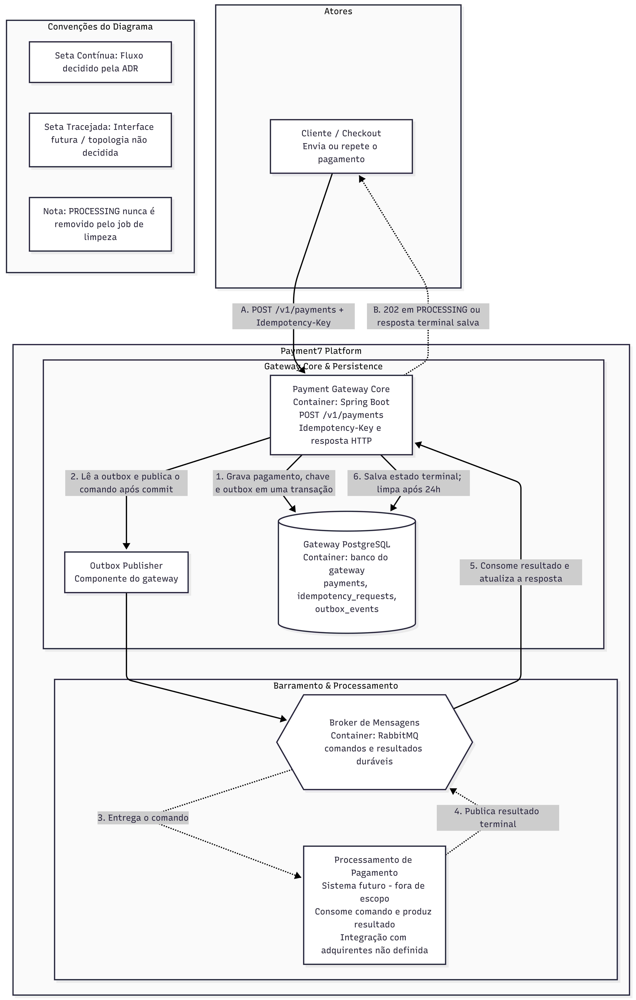

# ADR-005: Idempotência de Requisições de Pagamento

* **Status:** Aprovado
* **Data:** 2026-09-06
* **Autor:** Edir Lucas da Silva Icety Braga
* **Impacto:** `payment-gateway-core`

## 1. Contexto e Problema

Antes desta decisão, o `POST /v1/payments` validava somente o status do merchant; a autorização financeira e a persistência de pagamentos ainda não existiam no gateway. Ao evoluir o endpoint para aceitar uma intenção de pagamento, uma falha de rede ou timeout poderá ocorrer depois que o gateway recebeu a solicitação, mas antes de o cliente receber a resposta.

Nessa situação, o cliente não sabe se a operação foi aceita e costuma tentar novamente. Cliques repetidos, retries automáticos e requisições entregues simultaneamente também podem representar a mesma intenção de pagamento. Sem um identificador persistente e uma decisão atômica, duas requisições podem iniciar dois pagamentos e causar cobrança duplicada.

## 2. Decisão

O comando financeiro em `POST /v1/payments` exigirá o header `Idempotency-Key`. O cliente gerará uma chave UUID nova para cada intenção de pagamento e reutilizará exatamente essa chave apenas ao repetir a mesma intenção.

O gateway manterá um registro idempotente em PostgreSQL próprio, com chave única formada por contexto do solicitante, operação e `Idempotency-Key`. Enquanto não houver autenticação no gateway, o `merchantId` fará parte desse contexto. O registro conterá:

* hash canônico do payload da requisição;
* estado `PROCESSING` ou terminal;
* identificador do pagamento;
* status HTTP, corpo e headers relevantes da resposta terminal; e
* instante de conclusão e expiração da resposta terminal.

A existência da chave poderá ser consultada para acelerar o replay, mas uma ausência nessa consulta não autorizará o processamento. A decisão final será uma inserção protegida pela restrição única do banco. A requisição que criar o registro será a única autorizada a iniciar o processamento.

Na mesma transação local, o gateway persistirá o pagamento e o comando durável que o encaminhará para processamento. A forma de publicação, o serviço responsável pela integração com adquirentes e o seu contrato não são decididos por esta ADR. O objetivo desta persistência conjunta é não deixar uma chave em `PROCESSING` sem uma instrução recuperável para continuar o fluxo caso o gateway falhe.

Ao receber uma chave já existente, o gateway comparará o hash do payload:

* Se o payload for diferente, responderá `409 Conflict`; a chave não poderá ser reutilizada para outra intenção.
* Se o payload for igual e o estado for `PROCESSING`, responderá `202 Accepted` com o `paymentId`, sem iniciar outro processamento.
* Se o payload for igual e o estado for terminal, reproduzirá a resposta terminal salva, incluindo seu status HTTP.

Depois que a intenção for aceita, uma falha técnica ou resultado externo ainda desconhecido manterá o registro em `PROCESSING`. Um retry com a mesma chave nunca iniciará outra tentativa financeira por conta própria.

A resposta terminal e seu registro idempotente serão retidos por 24 horas a partir da conclusão. Depois desse prazo, uma requisição com a mesma chave não terá garantia de deduplicação e poderá ser considerada uma nova intenção. A chave de idempotência não substitui o identificador permanente do pagamento: após uma resposta definitiva, o cliente deve acompanhar o pagamento pelo `paymentId`.

Um job agendado removerá, em lotes, somente registros terminais cujo `expiresAt` tenha vencido. Registros em `PROCESSING` nunca serão removidos por esse job; eles exigem reconciliação operacional até obter um resultado definitivo. Registros pendentes além do tempo operacional esperado devem gerar alerta, mas continuam bloqueando a reutilização da chave.

## 3. Contrato HTTP

`Idempotency-Key` será obrigatório no comando financeiro de criação de pagamento. Chave ausente ou inválida resultará em `400 Bad Request`.

O `202 Accepted` representará uma intenção aceita, porém ainda em processamento, e retornará o `paymentId` para rastreamento. O contrato do recurso de consulta de pagamento será definido junto ao fluxo financeiro; esta ADR somente exige que a repetição do `POST` com a mesma chave permaneça segura.

## 4. Consequências

### Positivas

* Retrys e requisições simultâneas para a mesma intenção não iniciam cobranças independentes.
* O cliente recebe um resultado previsível enquanto o resultado financeiro é desconhecido.
* O PostgreSQL preserva a decisão mesmo se o Redis for limpo, expirar ou sofrer evicção.
* O registro transacional do pagamento e do comando reduz o risco de perder o processamento após aceitar a chave.
* A limpeza em lotes limita o crescimento dos registros terminalizados sem abrir uma janela para duplicidade de pagamentos pendentes.

### Riscos assumidos

* A garantia é de, no máximo, uma tentativa iniciada pelo gateway por chave enquanto o registro estiver `PROCESSING` e durante as 24 horas posteriores ao resultado terminal; ela não fornece *exactly-once* entre sistemas externos.
* Requisições reenviadas mais de 24 horas após o resultado terminal podem iniciar um novo pagamento.
* Registros em `PROCESSING` podem permanecer além de 24 horas se não houver resultado; eles dependem de reconciliação e monitoramento operacional.
* A autorização financeira e o serviço responsável por adquirentes permanecem fora do escopo desta ADR.

## 5. Critérios de Aceitação para a Implementação

* Duas requisições concorrentes com mesma chave e mesmo payload iniciam somente um processamento.
* Um retry após timeout retorna `202` enquanto pendente ou a resposta terminal armazenada, sem criar novo pagamento.
* Uma mesma chave com payload diferente retorna `409`.
* Resultados terminais de aprovação, recusa e erro de negócio são reproduzidos nos retries com a mesma chave.
* Depois de 24 horas de um resultado terminal, o registro é elegível para limpeza e uma nova tentativa não tem garantia de deduplicação.
* Um registro em `PROCESSING` não é removido pelo job de limpeza, mesmo que tenha mais de 24 horas.
